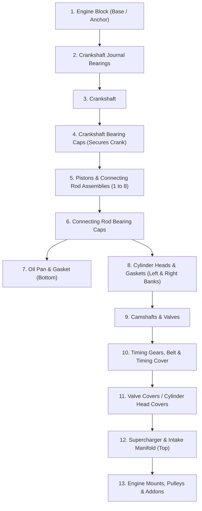

# V8 Engine CAD Conversion & Assembly Order Guide

This guide explains how to convert your unconverted CAD parts located in `Assets/V8 Engine(unconverted)` into Unity-ready 3D models and configure them using the **Assembly Snapping & Ghost System**.

---

## 1. Why CAD Files Need Conversion

Unity natively imports mesh formats such as `.fbx`, `.obj`, `.dae`, and `.gltf`. 

The files in your project:
- `.SLDPRT` (SolidWorks Part)
- `.SLDASM` (SolidWorks Assembly)
- `.x_t` (Parasolid 3D Model in `Assets/V8 Engine(unconverted)/Parasolid/V8_engine.x_t`)

These are boundary-representation (B-Rep / NURBS) parametric CAD formats. Unity requires polygonal meshes (triangles/vertices) to render in real-time.

---

## 2. Recommended Conversion Workflows

### Option A: Using FreeCAD (Free & Open Source)
1. Download & install **FreeCAD** ([freecad.org](https://www.freecad.org/)).
2. Open FreeCAD and import `Assets/V8 Engine(unconverted)/Parasolid/V8_engine.x_t` or individual `.SLDPRT` files.
3. In the Model tree, select the assembly or individual components.
4. Go to **File > Export** and choose:
   - **OBJ Format** (`.obj`) or **glTF Format** (`.gltf` / `.glb`).
5. In mesh export settings, set the deflection to ~`0.1mm - 0.2mm` for smooth engine curves without excessive poly count.
6. Drop the exported `.obj`/`.gltf` into `Assets/Models/EngineParts/`.

### Option B: Using SolidWorks (If you have access)
1. Open `V8_engine.SLDASM` or the individual parts in SolidWorks.
2. Choose **File > Save As...**
3. Under *Save as type*, select **FBX** (if using SolidWorks XR/Visualize) or **STEP AP214 (.step)** / **Parasolid (.x_t)**.
4. If using STEP/Parasolid, export as **OBJ** or use Blender to convert to FBX.

### Option C: Using CAD Exchanger or Pixyz
- **CAD Exchanger** ([cadexchanger.com](https://cadexchanger.com/)): Excellent dedicated batch converter that converts `.x_t`, `.SLDASM`, and `.SLDPRT` directly into `.fbx` with clean topology and retained hierarchies.
- **Unity Pixyz Plugin**: If using Unity Industry/Enterprise, Pixyz imports CAD directly in the Unity Editor.

---

## 3. Best Practices for Unity Engine Parts

| Principle | Recommendation |
| :--- | :--- |
| **Pivots** | Keep parts exported relative to the **Assembly Origin (0,0,0)** so that when placed at (0,0,0) on the Engine Block, they align automatically. |
| **Colliders** | Add a simple `BoxCollider` or `MeshCollider` (with Convex checked) to each part for grab detection. |
| **Scale** | Ensure export unit is **Meters** (or scale 0.001 if modeled in millimeters). |
| **Naming** | Name exported meshes clearly, e.g., `Part_Crankshaft.fbx`, `Part_Piston_01.fbx`. |

---

## 4. Recommended Authentic V8 Assembly Sequence

Below is the standard mechanical assembly order for a V8 engine, configured via `prerequisiteParts` or `assemblyOrderIndex`:

### Dependency Rules for `AssemblyPart`:
1. **Crankshaft**: Requires `Engine Block`.
2. **Crankshaft Bearing Caps**: Requires `Crankshaft`.
3. **Pistons (1-8)**: Require `Crankshaft`.
4. **Connecting Rod Caps**: Require their corresponding `Piston`.
5. **Oil Pan**: Requires `Crankshaft Bearing Caps` (bottom must be assembled first).
6. **Cylinder Heads**: Require `Engine Block` and `Pistons`.
7. **Timing Belt & Cover**: Requires `Crankshaft` and `Cylinder Heads`.
8. **Supercharger**: Requires `Cylinder Heads`.

---

## 5. Setting Up Parts with the Snapping & Ghost Script

### Step-by-Step Setup:
1. Place your converted 3D engine part GameObject in the scene at its assembled position on the engine block.
2. Add the `AssemblyPart` component:
   - Click Add Component > Engine Assembly > Assembly Part.
   - It automatically adds a Rigidbody with gravity enabled.
3. In the Inspector, click:
   - `[Create Snap Socket at Current Position]`
   - This automatically creates a socket at the exact target location and links it.
4. Move your part away to a workbench, parts rack, or wherever you want.
   - Because gravity is enabled, it rests naturally on tables or floors.
5. (Optional) In Prerequisite Parts, add any parts that must be assembled before this one.

### Playing in Play Mode:
1. **Pick up**: Look at the part and press `E` or Left-Click. The part is held in your hand.
2. **Move near socket**: Walk near the position where the part belongs (within 4 meters). The translucent ghost preview appears!
3. **Click to snap**: Aim at the ghost (it turns bright green) and press `E` or Left-Click.
4. **Glow and lock**:
   - The part snaps smoothly into place.
   - The ghost disappears.
   - The part glows green for a moment (1.2 seconds) as confirmation.
   - It remains locked in that position with physics disabled.
5. **Gravity**: The part follows realistic physics and gravity until it is snapped.
